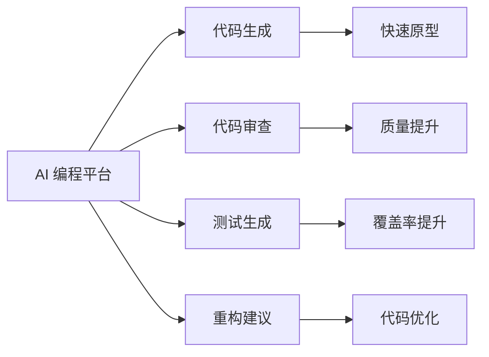
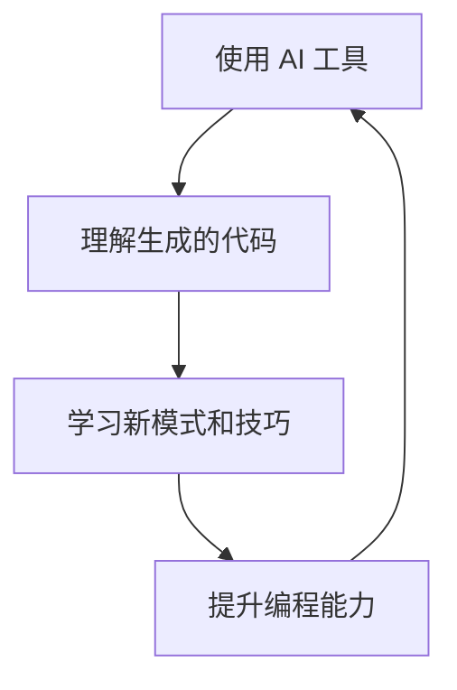

# AI 编程概述

AI 编程是利用人工智能技术辅助或增强软件开发过程的新兴领域。

## 什么是 AI 编程？

AI 编程（AI-Powered Programming）是指使用 AI 工具和技术来提升开发效率、代码质量和创新能力的编程方式。

### 核心特点

- 🤖 **智能代码生成** - AI 根据需求自动生成代码
- 💡 **智能补全** - 上下文感知的代码建议
- 🔍 **代码理解** - AI 帮助理解和解释代码
- 🐛 **智能调试** - 自动发现和修复问题
- 📝 **文档生成** - 自动生成代码文档

## AI 编程工具

### 代码助手

| 工具 | 特点 | 适用场景 |
|------|------|----------|
| **GitHub Copilot** | 实时代码建议 | IDE 内编程 |
| **Cursor** | AI-first 编辑器 | 全栈开发 |
| **Claude** | 对话式编程 | 复杂需求开发 |
| **ChatGPT** | 通用 AI 助手 | 代码咨询 |
| **Codeium** | 免费 AI 补全 | 个人开发 |

### AI 编程平台



## AI 编程工作流

### 1. 需求分析阶段

使用 AI 帮助：
- 理解和澄清需求
- 生成用户故事
- 设计系统架构

```markdown
👤 用户：我想创建一个博客系统

🤖 AI：让我帮你分析需求：
1. 用户管理（注册、登录、权限）
2. 文章管理（CRUD、分类、标签）
3. 评论系统
4. 搜索功能
5. ...
```

### 2. 开发阶段

```python
# AI 辅助代码生成示例
# 需求：创建一个用户认证中间件

from functools import wraps
from flask import request, jsonify
import jwt

def token_required(f):
    """JWT 认证装饰器"""
    @wraps(f)
    def decorated(*args, **kwargs):
        token = request.headers.get('Authorization')
        
        if not token:
            return jsonify({'message': '缺少认证令牌'}), 401
        
        try:
            # 移除 'Bearer ' 前缀
            token = token.split(' ')[1]
            # 验证 token
            data = jwt.decode(token, app.config['SECRET_KEY'], 
                            algorithms=['HS256'])
            current_user = User.query.get(data['user_id'])
        except Exception as e:
            return jsonify({'message': '无效的认证令牌'}), 401
        
        return f(current_user, *args, **kwargs)
    
    return decorated
```

### 3. 测试阶段

AI 可以帮助生成测试用例：

```python
# AI 生成的单元测试
import pytest
from app import create_app, db
from app.models import User

@pytest.fixture
def client():
    app = create_app('testing')
    with app.test_client() as client:
        with app.app_context():
            db.create_all()
        yield client
        with app.app_context():
            db.drop_all()

def test_user_registration(client):
    """测试用户注册"""
    response = client.post('/api/register', json={
        'username': 'testuser',
        'email': 'test@example.com',
        'password': 'password123'
    })
    
    assert response.status_code == 201
    assert b'success' in response.data

def test_user_login(client):
    """测试用户登录"""
    # 先注册
    client.post('/api/register', json={
        'username': 'testuser',
        'email': 'test@example.com',
        'password': 'password123'
    })
    
    # 再登录
    response = client.post('/api/login', json={
        'email': 'test@example.com',
        'password': 'password123'
    })
    
    assert response.status_code == 200
    assert 'token' in response.json
```

### 4. 代码审查阶段

AI 可以：
- 检查代码质量
- 发现潜在 bug
- 提供优化建议
- 检查安全问题

## AI 编程最佳实践

### 1. 清晰的提示（Prompt）

<CustomCard title="好的提示示例" icon="✅" variant="success">

**具体明确**：
```
创建一个 Python 函数，接收用户列表（包含 name 和 age），
返回年龄大于 18 岁的用户，按年龄降序排序。
包含类型注解和文档字符串。
```

</CustomCard>

<CustomCard title="不好的提示" icon="❌" variant="danger">

**模糊不清**：
```
写一个函数处理用户数据
```

</CustomCard>

### 2. 迭代式开发

```markdown
1️⃣ 生成基础代码框架
2️⃣ 添加核心功能
3️⃣ 优化和重构
4️⃣ 添加错误处理
5️⃣ 完善文档和测试
```

### 3. 代码审查

始终审查 AI 生成的代码：
- ✅ 检查逻辑正确性
- ✅ 验证边界情况
- ✅ 确认安全性
- ✅ 优化性能

### 4. 持续学习



## AI 编程的优势

### 提升效率

- ⚡ **快速原型开发** - 几分钟内创建可用原型
- 🔄 **自动化重复任务** - 减少样板代码编写
- 📚 **快速学习新技术** - AI 提供即时指导

### 提高质量

- 🐛 **减少 bug** - AI 帮助发现潜在问题
- 📖 **改善文档** - 自动生成清晰文档
- ♻️ **代码重构** - 智能优化建议

### 创新能力

- 💡 **探索新方案** - AI 提供多种实现方式
- 🎯 **专注核心逻辑** - 减少琐碎工作
- 🚀 **快速试错** - 降低实验成本

## AI 编程的挑战

::: warning 注意事项
1. **代码质量不保证** - 需要人工审查
2. **安全问题** - AI 可能生成有漏洞的代码
3. **依赖性** - 过度依赖可能影响编程能力
4. **隐私问题** - 注意敏感代码泄露
:::

## 实战案例

### 案例 1：快速搭建 REST API

使用 AI 在 10 分钟内搭建完整的 REST API：

```python
# 1. 让 AI 生成项目结构
# 2. 生成模型定义
# 3. 生成 API 端点
# 4. 生成测试用例
# 5. 生成文档

# 最终得到完整可运行的项目
```

### 案例 2：代码迁移

从 JavaScript 迁移到 TypeScript：

```typescript
// 原 JavaScript 代码
function calculateTotal(items) {
    return items.reduce((sum, item) => sum + item.price, 0);
}

// AI 转换为 TypeScript
interface Item {
    name: string;
    price: number;
    quantity: number;
}

function calculateTotal(items: Item[]): number {
    return items.reduce((sum, item) => sum + item.price, 0);
}
```

### 案例 3：性能优化

AI 帮助优化数据库查询：

```python
# 优化前 - N+1 查询问题
def get_posts_with_authors():
    posts = Post.query.all()
    return [{
        'title': post.title,
        'author': post.author.name  # 每次都查询
    } for post in posts]

# AI 优化后 - 使用 join
def get_posts_with_authors():
    posts = Post.query.join(User).all()
    return [{
        'title': post.title,
        'author': post.author.name  # 已预加载
    } for post in posts]
```

## 学习资源

### 工具文档
- [GitHub Copilot 文档](https://docs.github.com/copilot)
- [Cursor 官网](https://cursor.sh/)
- [Claude API 文档](https://docs.anthropic.com/)

### 学习路径

1. **入门阶段**
   - 了解 AI 编程基本概念
   - 尝试使用 GitHub Copilot
   - 学习编写有效的提示

2. **进阶阶段**
   - 探索高级 AI 工具
   - 学习 Prompt Engineering
   - 实践复杂项目开发

3. **精通阶段**
   - 自定义 AI 工作流
   - 集成多个 AI 工具
   - 贡献开源项目

## 下一步

- 学习 [Claude Code Cheat Sheet](./claude-cheat-sheet) - 快速掌握 Claude 编程技巧
- 探索更多 AI 编程工具和最佳实践
- 实践 AI 编程项目

## 总结

AI 编程正在改变软件开发的方式，但它是工具而非替代品。关键是：

- 🎯 **理解原理** - 知道 AI 生成了什么
- 🔍 **仔细审查** - 验证代码质量和安全性
- 📈 **持续学习** - 跟上技术发展
- 🤝 **人机协作** - 发挥各自优势

拥抱 AI 编程，成为更高效的开发者！🚀

